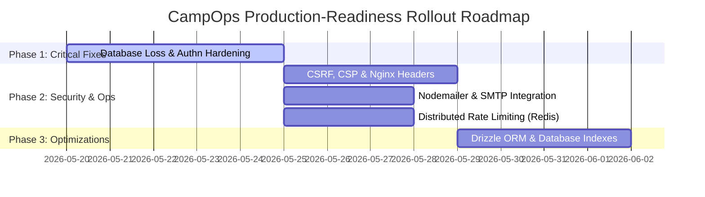

CampOps Marketplace – Production‑Readiness Implementation Plan

# Execution Roadmap

This Execution Roadmap outlines the timeline, phase gates, parallelizable tasks, and verification checkpoints to resolve all findings in the CampOps Marketplace security and architecture audit.



### Phasing & Rollout Strategy

1. **Phase 1: Critical Vulnerabilities (Immediate)**
   - Fix database loss on boot for PostgreSQL.
   - Enforce server-side authentication across all critical API routes (`admin`, `master`, `properties`, and `listing-access`).
   - Remove fail-open fallbacks and client-side cookie role trust.
   - _Phase Gate:_ Vitest and E2E suites must pass with mock session tokens.

2. **Phase 2: High & Medium Infrastructure Security (Parallelizable)**
   - Hardening session cookies and CSRF via Better Auth configuration.
   - Configure CSP and HSTS headers in both Next.js middleware and Nginx.
   - Implement distributed Redis rate limiter alongside custom health check location blocks in Nginx.
   - Replace console-log email fallback with Nodemailer SMTP transport.
   - _Phase Gate:_ Deploy to staging, verify HSTS, CSP, and rate-limiting responses via `curl` and browser developer tools.

3. **Phase 3: Code Quality & Performance (Final)**
   - Add database index definitions to SQLite schema (`schema.ts`) and PostgreSQL schema (`schema.sql`).
   - Refactor raw SQL queries to typed Drizzle ORM operations.
   - _Phase Gate:_ Verify no performance regression on database reads and write operations.

---

# Severity-Based Implementation Plan

## Critical Severity Findings

### Critical 1.1: Database Loss on Server Restart

- **Priority:** Critical
- **Reference:** Critical 1.1
- **File Path:** `src/lib/db.ts`
- **Description:** When the application runs in PostgreSQL mode or encounters SQLite database checks, `getSqlite()` throws a TypeError (since `sqliteDb` is null). The catch block handles this by calling `db.resetMockStore()`, which drops and recreates all database tables, leading to complete data loss on every restart.
- **Before Code:**

```typescript
// Always ensure seeded in dev/test if users table missing or empty
try {
  const criticalTables = ['users', 'properties', 'available_plugins', 'property_staff'];
  let needsReset = false;

  for (const table of criticalTables) {
    const tableExists = getSqlite()
      .prepare("SELECT count(*) as count FROM sqlite_master WHERE type='table' AND name=?")
      .get(table);
    if (!tableExists || (tableExists as any).count === 0) {
      needsReset = true;
      break;
    }
    const rowCount = getSqlite().prepare(`SELECT count(*) as count FROM ${table}`).get();
    if (!rowCount || (rowCount as any).count === 0) {
      needsReset = true;
      break;
    }
  }

  if (needsReset) {
    logger.info('Critical table missing or empty, forcing reset...');
    db.resetMockStore();
  }
} catch (e) {
  logger.error('Error checking database state:', e);
  db.resetMockStore();
}
```

- **After Code:**

```typescript
// Always ensure seeded in dev/test if users table missing or empty
// DO NOT check or reset the store in production, PostgreSQL, or unless specifically instructed via CLI args.
const shouldRunResetCheck =
  process.env.NODE_ENV !== 'production' &&
  !process.env.DATABASE_URL?.startsWith('postgres') &&
  (process.env.NODE_ENV === 'test' || process.argv.includes('--force-reset'));

if (shouldRunResetCheck) {
  try {
    const criticalTables = ['users', 'properties', 'available_plugins', 'property_staff'];
    let needsReset = false;

    for (const table of criticalTables) {
      const tableExists = getSqlite()
        .prepare("SELECT count(*) as count FROM sqlite_master WHERE type='table' AND name=?")
        .get(table);
      if (!tableExists || (tableExists as any).count === 0) {
        needsReset = true;
        break;
      }
      const rowCount = getSqlite().prepare(`SELECT count(*) as count FROM ${table}`).get();
      if (!rowCount || (rowCount as any).count === 0) {
        needsReset = true;
        break;
      }
    }

    if (needsReset) {
      logger.info('Critical table missing or empty, forcing reset...');
      db.resetMockStore();
    }
  } catch (e) {
    logger.error('Error checking database state:', e);
  }
}
```

- **Testing Instructions:**
  1. Boot the server locally using PostgreSQL (`DATABASE_URL=postgres://... npm run dev`). Verify that the application does not drop and recreate the PostgreSQL tables.
  2. Boot the server using SQLite (`NODE_ENV=production npm run dev`). Verify that starting the server does not reset or wipe existing database records in the SQLite `.db` file.

---

### Critical 1.2: Unauthenticated Critical API Routes

- **Priority:** Critical
- **Reference:** Critical 1.2
- **File Paths:**
  - `src/app/api/admin/plugins/route.ts`
  - `src/app/api/master/plugins/route.ts`
  - `src/app/api/properties/route.ts`
  - `src/app/api/public/book/route.ts`
  - `src/app/api/listing-access/route.ts`
  - `src/app/api/guest/reservations/route.ts`
- **Description:** Multiple administrative, tenant, and guest data endpoints read security credentials from query parameters or client-controlled, plain cookies, exposing them to privilege escalation and data leakage.
- **Before Code (src/app/api/admin/plugins/route.ts):**

```typescript
export async function GET(req: NextRequest) {
  try {
    const { searchParams } = req.nextUrl;
    const adminId = searchParams.get('adminId');
    const category = searchParams.get('category');

    if (!adminId) {
      return NextResponse.json({ error: 'adminId is required' }, { status: 400 });
    }

    const isAdmin = await verifyAdminAccess(adminId);
    if (!isAdmin) {
      return NextResponse.json({ error: 'Unauthorized' }, { status: 403 });
    }
```

- **After Code (src/app/api/admin/plugins/route.ts):**

```typescript
import { auth } from '@/lib/auth';

export async function GET(req: NextRequest) {
  try {
    const session = await auth.api.getSession({ headers: req.headers });
    if (!session) {
      return NextResponse.json({ error: 'Unauthorized: Session required' }, { status: 401 });
    }

    const isAdmin = await verifyAdminAccess(session.user.id);
    if (!isAdmin) {
      return NextResponse.json({ error: 'Unauthorized: marketplace_master role required' }, { status: 403 });
    }

    const { searchParams } = req.nextUrl;
    const category = searchParams.get('category');
```

- **Before Code (src/app/api/master/plugins/route.ts):**

```typescript
export async function GET(req: NextRequest) {
  try {
    if (process.env.NODE_ENV !== 'test') {
      console.log('[Master Plugins API] Syncing plugins...');
      await PluginDiscoveryService.syncPlugins().catch((e) => console.error('Sync failed', e));
    }
    // ... fetches all plugins without verifying request credentials
```

- **After Code (src/app/api/master/plugins/route.ts):**

```typescript
import { auth } from '@/lib/auth';

async function verifyMasterAccess(userId: string): Promise<boolean> {
  const role = await db
    .prepare("SELECT role FROM user_roles WHERE user_id = $1 AND role IN ('master', 'marketplace_master')")
    .get(userId);
  return !!role;
}

export async function GET(req: NextRequest) {
  try {
    const session = await auth.api.getSession({ headers: req.headers });
    if (!session) {
      return NextResponse.json({ error: 'Unauthorized' }, { status: 401 });
    }

    const isMaster = await verifyMasterAccess(session.user.id);
    if (!isMaster) {
      return NextResponse.json({ error: 'Forbidden' }, { status: 403 });
    }

    if (process.env.NODE_ENV !== 'test') {
      console.log('[Master Plugins API] Syncing plugins...');
      await PluginDiscoveryService.syncPlugins().catch((e) => console.error('Sync failed', e));
    }
```

- **Before Code (src/app/api/properties/route.ts):**

```typescript
export async function GET(req: NextRequest) {
  const ownerId = req.nextUrl.searchParams.get('ownerId');

  if (!ownerId) {
    return NextResponse.json({ error: 'ownerId is required' }, { status: 400 });
  }

  try {
    const properties = await db
      .prepare(`
      SELECT p.*, u.email as owner_email
      FROM properties p
      JOIN users u ON u.id = p.owner_id
      WHERE p.owner_id = $1
      ORDER BY p.created_at DESC
    `)
      .all(ownerId);
```

- **After Code (src/app/api/properties/route.ts):**

```typescript
import { auth } from '@/lib/auth';

export async function GET(req: NextRequest) {
  const ownerId = req.nextUrl.searchParams.get('ownerId');

  if (!ownerId) {
    return NextResponse.json({ error: 'ownerId is required' }, { status: 400 });
  }

  try {
    const session = await auth.api.getSession({ headers: req.headers });
    if (!session) {
      return NextResponse.json({ error: 'Unauthorized' }, { status: 401 });
    }

    const isMaster = await db
      .prepare("SELECT role FROM user_roles WHERE user_id = $1 AND role IN ('master', 'marketplace_master')")
      .get(session.user.id);

    const isAuthorized = session.user.id === ownerId || !!isMaster;
    if (!isAuthorized) {
      return NextResponse.json({ error: 'Forbidden' }, { status: 403 });
    }

    const properties = await db
      .prepare(`
      SELECT p.*, u.email as owner_email
      FROM properties p
      JOIN users u ON u.id = p.owner_id
      WHERE p.owner_id = $1
      ORDER BY p.created_at DESC
    `)
      .all(ownerId);
```

- **Before Code (src/app/api/listing-access/route.ts):**

```typescript
if (session) {
  userId = session.user.id;
  userRole = (session.user as any).role || 'guest';
} else {
  // Fallback for manual test tokens or if session lookup fails in middleware fetch
  const token =
    req.cookies.get('sinaicamps_token')?.value ||
    req.cookies.get('better-auth.session_token')?.value;
  const roleCookie = req.cookies.get('sinaicamps_role')?.value;

  if (roleCookie === 'manager' || (token && token.includes('manager'))) {
    userId = 'manager-user-1';
    userRole = 'manager';
  } else if (roleCookie === 'master' || (token && token.includes('master'))) {
    userId = 'master-user-2';
    userRole = 'master';
  } else if (roleCookie === 'staff') {
    userId = 'staff-user-1';
    userRole = 'staff';
  } else {
    return NextResponse.json({ error: 'Unauthorized' }, { status: 401 });
  }
}
```

- **After Code (src/app/api/listing-access/route.ts):**

```typescript
if (!session) {
  // Fail closed: do not allow cookie-based role spoofing.
  return NextResponse.json({ error: 'Unauthorized' }, { status: 401 });
}

userId = session.user.id;
userRole = (session.user as any).role || 'guest';
```

- **Before Code (src/app/api/guest/reservations/route.ts):**

```typescript
let userId: string | null = null;
if (session) {
  userId = session.user.id;
} else {
  // Fallback: resolve user from sinaicamps_role cookie for test environments
  const roleCookie = req.cookies.get('sinaicamps_role')?.value;
  if (roleCookie === 'guest') {
    userId = 'guest-user-1';
  } else if (roleCookie === 'manager') {
    userId = 'manager-user-1';
  }
}
```

- **After Code (src/app/api/guest/reservations/route.ts):**

```typescript
if (!session) {
  return NextResponse.json({ error: 'Unauthorized' }, { status: 401 });
}
const userId = session.user.id;
```

- **Testing Instructions:**
  1. Attempt to fetch `/api/admin/plugins?adminId=master-admin` from a client without sending authentication cookies. Verify that the response returns `401 Unauthorized`.
  2. Attempt to toggle global plugin status via POST `/api/master/plugins` without session credentials. Verify that the server returns `401 Unauthorized`.

---

## High Severity Findings

### High 2.1: No CSRF Protection

- **Priority:** High
- **Reference:** High 2.1
- **File Path:** `src/lib/auth.ts`
- **Description:** Better Auth requires appropriate client configuration and matching `trustedOrigins` settings to enforce CSRF validation on API endpoints.
- **Implementation Steps:** Add the CSRF protection and origin validation to Better Auth configuration in `src/lib/auth.ts`:

```typescript
export const auth = betterAuth({
  trustedOrigins: [
    'http://localhost:3000',
    'http://127.0.0.1:3000',
    ...(process.env.TRUSTED_ORIGINS ? process.env.TRUSTED_ORIGINS.split(',') : []),
  ],
  advanced: {
    // Enables browser origin checks and CSRF token validations
    useSecureCookies: process.env.NODE_ENV === 'production',
  },
  // ... rest of the settings
```

---

### High 2.2: Cookie Security Flags Not Set

- **Priority:** High
- **Reference:** High 2.2
- **File Path:** `src/lib/auth.ts`
- **Description:** Ensure session cookies use the `HttpOnly`, `Secure`, and explicit `SameSite` flags. Set a shared cookie domain to allow cross-subdomain authentication.
- **Implementation Steps:** Add `defaultCookieAttributes` to `src/lib/auth.ts`:

```typescript
  advanced: {
    useSecureCookies: process.env.NODE_ENV === 'production',
    crossSubDomainCookies: {
      enabled: true,
    },
    defaultCookieAttributes: {
      sameSite: 'lax',
      secure: process.env.NODE_ENV === 'production',
      httpOnly: true,
      domain: process.env.COOKIE_DOMAIN || '.sinaicamps.com',
    },
  },
```

---

### High 2.3: CSP Headers Missing

- **Priority:** High
- **Reference:** High 2.3
- **File Paths:**
  - `src/middleware.ts`
  - `nginx-unified.conf`
  - `nginx-acacia.conf`
  - `nginx-multi-tenant.conf`
- **Description:** Inject a strict Content-Security-Policy (CSP) header into all HTTP responses to prevent Cross-Site Scripting (XSS) attacks.
- **Implementation Steps:**
  1. Add CSP configuration to `src/middleware.ts`:

```typescript
const cspHeader = `
  default-src 'self';
  script-src 'self' 'unsafe-eval' 'unsafe-inline';
  style-src 'self' 'unsafe-inline';
  img-src 'self' blob: data: https:;
  font-src 'self' data:;
  connect-src 'self' https:;
  frame-src 'self';
  object-src 'none';
  base-uri 'self';
  form-action 'self';
  frame-ancestors 'none';
`
  .replace(/\s{2,}/g, ' ')
  .trim();

// Apply CSP in middleware
const next = response instanceof NextResponse ? response : NextResponse.next();
next.headers.set('Content-Security-Policy', cspHeader);
```

---

### High 2.4: In-Memory Rate Limiter — Not Distributed

- **Priority:** High
- **Reference:** High 2.4
- **File Path:** `src/lib/rateLimit.ts`
- **Description:** Implement a Redis-backed rate limiter to support distributed environments (e.g. running under PM2 cluster or multiple containers).
- **Implementation Steps:**
  1. Install `ioredis` package: `npm install ioredis`.
  2. Implement Redis fallback rate limiting:

```typescript
import Redis from 'ioredis';
import { RateLimitError } from './errors';
import { logger } from './logger';

let redisClient: Redis | null = null;
if (process.env.REDIS_URL) {
  try {
    redisClient = new Redis(process.env.REDIS_URL, {
      maxRetriesPerRequest: 1,
      lazyConnect: true,
    });
    redisClient.on('error', (err) => logger.warn('Redis connection failed:', err));
  } catch (err) {
    logger.warn('Failed to construct Redis client:', err);
  }
}

export class RateLimiter {
  private windows = new Map<string, WindowEntry>();
  private maxRequests: number;
  private windowMs: number;

  constructor(maxRequests = 100, windowMs = 60_000) {
    this.maxRequests = maxRequests;
    this.windowMs = windowMs;
  }

  async check(key: string): Promise<{ remaining: number; reset: number; limit: number }> {
    if (redisClient) {
      try {
        const redisKey = `rl:${key}`;
        const pipeline = redisClient.pipeline();
        pipeline.incr(redisKey);
        pipeline.ttl(redisKey);
        const results = await pipeline.exec();

        if (results) {
          const count = results[0][1] as number;
          const ttl = results[1][1] as number;

          if (ttl === -1) {
            await redisClient.expire(redisKey, Math.ceil(this.windowMs / 1000));
          }

          if (count > this.maxRequests) {
            throw new RateLimitError('Too many requests', ttl > 0 ? ttl : 60);
          }

          return {
            remaining: this.maxRequests - count,
            reset: Date.now() + (ttl > 0 ? ttl * 1000 : this.windowMs),
            limit: this.maxRequests,
          };
        }
      } catch (err) {
        if (err instanceof RateLimitError) throw err;
        logger.warn('Redis rate limit check failed, falling back to memory:', err);
      }
    }

    // In-memory fallback
    const now = Date.now();
    const entry = this.windows.get(key);
    // ... (rest of standard in-memory sliding-window check)
  }
}
```

---

### High 2.5: Auth-Protected Routes Rely on Cookie Token with No Signature Verification

- **Priority:** High
- **Reference:** High 2.5
- **File Paths:**
  - `src/app/api/listing-access/route.ts`
  - `src/app/api/guest/reservations/route.ts`
- **Description:** These routes resolve roles and users directly from client-supplied cookies (`sinaicamps_role` or `sinaicamps_token`) without validating signatures or looking up the session in the session store.
- **Implementation Steps:** Remove cookie role verification logic in `src/app/api/listing-access/route.ts` (see changes in Critical 1.2).

---

### High 2.8: Email Service is a No-Op in Production

- **Priority:** High
- **Reference:** High 2.8
- **File Path:** `src/lib/email.ts`
- **Description:** Implement a production-grade Nodemailer SMTP transporter that resolves parameters from environment variables (`SMTP_HOST`, `SMTP_PORT`, `SMTP_USER`, `SMTP_PASS`).
- **Implementation Steps:**
  1. Install `nodemailer` and `@types/nodemailer`.
  2. Implement transporter initialization and SMTP execution:

```typescript
import nodemailer from 'nodemailer';

let transporter: nodemailer.Transporter | null = null;
if (process.env.SMTP_HOST) {
  transporter = nodemailer.createTransport({
    host: process.env.SMTP_HOST,
    port: parseInt(process.env.SMTP_PORT || '587'),
    secure: process.env.SMTP_PORT === '465',
    auth: {
      user: process.env.SMTP_USER,
      pass: process.env.SMTP_PASS,
    },
  });
}

export class EmailService {
  static async send(opts: EmailOptions): Promise<void> {
    const from = opts.from || process.env.EMAIL_FROM || 'noreply@sinaicamps.com';

    if (transporter) {
      try {
        await transporter.sendMail({
          from,
          to: opts.to,
          subject: opts.subject,
          html: opts.html,
        });
        logger.info(`Email sent to ${opts.to} via SMTP`);
        return;
      } catch (err) {
        logger.error(`SMTP transmission failed:`, err);
        throw err;
      }
    }
    // console log fallback for local development...
```

---

### High 2.10: Missing Input Validation on Booking Endpoint

- **Priority:** High
- **Reference:** High 2.10
- **File Path:** `src/app/api/public/book/route.ts`
- **Description:** Validate payloads on booking requests using Zod to enforce expected parameter types and prevent malformed query input.
- **Implementation Steps:**

```typescript
import { z } from 'zod';

const bookingInputSchema = z.object({
  propertyId: z.string().min(1),
  roomTypeId: z.string().optional(),
  checkIn: z.string().regex(/^\d{4}-\d{2}-\d{2}$/),
  checkOut: z.string().regex(/^\d{4}-\d{2}-\d{2}$/),
  guestName: z.string().min(1),
  guestEmail: z.string().email(),
  adults: z.number().int().positive().optional(),
  paymentProvider: z.string().optional(),
  currency: z.string().optional(),
});

export async function POST(req: NextRequest) {
  try {
    const body = await req.json();
    const result = bookingInputSchema.safeParse(body);
    if (!result.success) {
      return NextResponse.json({ error: 'Validation failed', details: result.error.flatten() }, { status: 400 });
    }
    const { propertyId, roomTypeId, checkIn, checkOut, guestName, guestEmail } = result.data;
```

---

## Medium Severity Findings

### Medium 2.6: No Endpoint for Active Health Checks

- **Priority:** Medium
- **Reference:** Reference 2.6
- **File Paths:**
  - `src/app/api/health/route.ts`
  - `nginx-unified.conf`
- **Description:** Expose the health check route through Nginx while preventing exposure of detailed environment stats to public traffic.
- **Implementation Steps (nginx-unified.conf):**

```nginx
    location /api/health {
        proxy_pass http://localhost:3000/api/health;
        proxy_http_version 1.1;
        proxy_set_header Host $host;
        access_log off;
        allow 127.0.0.1;
        allow 10.0.0.0/8;
        allow 172.16.0.0/12;
        allow 192.168.0.0/16;
        deny all;
    }
```

---

### Medium 2.7: No Graceful Shutdown

- **Priority:** Medium
- **Reference:** Reference 2.7
- **File Path:** `src/lib/db.ts`
- **Description:** Handle system termination signals (`SIGTERM` and `SIGINT`) to close PostgreSQL pools and SQLite connections before the container exits.
- **Implementation Steps:** Add the following shutdown listener to the bottom of `src/lib/db.ts`:

```typescript
export async function closeConnection() {
  if (pgPool) {
    logger.info('Closing PostgreSQL pool...');
    await pgPool.end();
    pgPool = null;
  }
  if (sqliteDb) {
    logger.info('Closing SQLite database...');
    sqliteDb.close();
    sqliteDb = null;
  }
}

if (typeof process !== 'undefined') {
  const handleShutdown = async (signal: string) => {
    logger.info(`Received ${signal}, commencing graceful database shutdown.`);
    await closeConnection();
    process.exit(0);
  };
  process.on('SIGTERM', () => handleShutdown('SIGTERM'));
  process.on('SIGINT', () => handleShutdown('SIGINT'));
}
```

---

### Medium 2.9: Missing HTTP Security Headers

- **Priority:** Medium
- **Reference:** Reference 2.9
- **File Paths:**
  - `src/middleware.ts`
  - `nginx-unified.conf`
- **Description:** Inject essential HTTP security headers (`Strict-Transport-Security`, `X-Content-Type-Options`, `X-Frame-Options`, `X-XSS-Protection`, `Referrer-Policy`) to secure user browsers.
- **Implementation Steps (nginx-unified.conf):**

```nginx
    # Secure SSL Protocols & Ciphers
    ssl_protocols TLSv1.2 TLSv1.3;
    ssl_prefer_server_ciphers on;
    ssl_ciphers 'ECDHE-ECDSA-AES128-GCM-SHA256:ECDHE-RSA-AES128-GCM-SHA256:ECDHE-ECDSA-AES256-GCM-SHA384:ECDHE-RSA-AES256-GCM-SHA384:DHE-RSA-AES128-GCM-SHA256:DHE-RSA-AES256-GCM-SHA384';

    # Browser Security Headers
    add_header Strict-Transport-Security "max-age=63072000; includeSubDomains; preload" always;
    add_header X-Content-Type-Options nosniff always;
    add_header X-Frame-Options DENY always;
    add_header X-XSS-Protection "1; mode=block" always;
    add_header Referrer-Policy "strict-origin-when-cross-origin" always;
```

---

## Low Severity Findings

### Low 3.1: Raw SQL in Codebase

- **Priority:** Low
- **Reference:** Reference 3.1
- **File Paths:**
  - `src/app/api/admin/plugins/route.ts`
  - `src/app/api/site/posts/route.ts`
- **Description:** Replace raw SQL prepared statements with type-safe Drizzle ORM operations to enforce query correctness at compile time.
- **Implementation Steps (src/app/api/admin/plugins/route.ts):**

```typescript
// Before
const role = await db.prepare('SELECT role FROM user_roles WHERE user_id = $1').get(userId);

// After
import { userRoles } from '@/db/schema';
import { eq, and } from 'drizzle-orm';
const rolesList = await db
  .select()
  .from(userRoles)
  .where(and(eq(userRoles.userId, userId), eq(userRoles.role, 'marketplace_master')));
const isAdmin = rolesList.length > 0;
```

---

### Low 3.2: Missing Database Indexes in SQLite Schema

- **Priority:** Low
- **Reference:** Reference 3.2
- **File Paths:**
  - `src/db/schema.ts`
  - `schema.sql`
- **Description:** Add performance indexes to `posts`, `postmeta`, `options`, and `available_themes` tables in both the Drizzle schema and the production PostgreSQL initialization script.
- **Implementation Steps (src/db/schema.ts):**

```typescript
import { index } from 'drizzle-orm/sqlite-core';

export const posts = sqliteTable(
  'posts',
  {
    // ... fields
  },
  (table) => ({
    siteTypeStatusIdx: index('idx_posts_site_type_status').on(
      table.siteId,
      table.postType,
      table.postStatus
    ),
    slugIdx: index('idx_posts_slug').on(table.postSlug),
    createdIdx: index('idx_posts_created').on(table.createdAt),
  })
);
```

- **Implementation Steps (schema.sql):**

```sql
CREATE INDEX IF NOT EXISTS idx_posts_site_type_status ON posts(site_id, post_type, post_status);
CREATE INDEX IF NOT EXISTS idx_posts_slug ON posts(post_slug);
CREATE INDEX IF NOT EXISTS idx_posts_created ON posts(created_at);
CREATE INDEX IF NOT EXISTS idx_postmeta_post_key ON postmeta(post_id, meta_key);
CREATE INDEX IF NOT EXISTS idx_options_site_name ON options(site_id, option_name);
CREATE INDEX IF NOT EXISTS idx_available_themes_name ON available_themes(name);
CREATE INDEX IF NOT EXISTS idx_available_themes_active ON available_themes(is_active);
```
