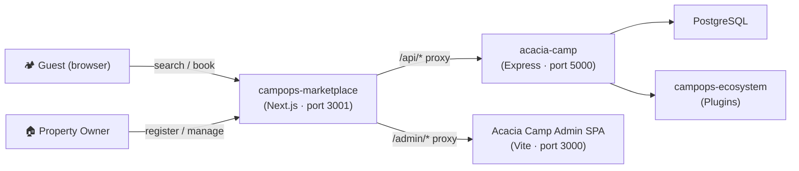

# CampOps Marketplace

> The public-facing hub for the CampOps platform — a Next.js application that lets guests discover and book camps, and lets owners self-register, manage their listings, and (on premium plans) access the full Acacia Camp operations suite.

---

## What is this?

**CampOps Marketplace** is the main entry point for the entire CampOps ecosystem. It is built with [Next.js 14](https://nextjs.org), [Tailwind CSS](https://tailwindcss.com), and [next-intl](https://next-intl-docs.vercel.app). It connects to a running **Acacia Camp** backend (Express API) and optionally proxies the Acacia Camp admin SPA for premium property owners.



---

## Quick Start

### Prerequisites

| Tool | Version |
|------|---------|
| Node.js | ≥ 20 |
| npm | ≥ 10 |
| Running Acacia Camp backend | see [integrating-acacia-camp.md](docs/integrating-acacia-camp.md) |

### 1. Clone

```bash
git clone https://github.com/your-org/campops-marketplace.git
cd campops-marketplace
```

### 2. Install dependencies

```bash
npm install
```

### 3. Configure environment

```bash
cp .env.example .env.local
# Edit .env.local — at minimum set NEXT_PUBLIC_API_URL
```

### 4. Run in development

```bash
npm run dev        # starts on http://localhost:3001
```

### 5. Open

- Guest search: [http://localhost:3001/en/search](http://localhost:3001/en/search)
- Owner registration: [http://localhost:3001/en/list-your-camp](http://localhost:3001/en/list-your-camp)

---

## Repository Structure

```
campops-marketplace/
├── src/
│   ├── app/
│   │   ├── [locale]/
│   │   │   ├── page.tsx                    ← redirect to /search
│   │   │   ├── layout.tsx                  ← locale wrapper (Nav + Footer)
│   │   │   ├── search/page.tsx             ← property search
│   │   │   ├── stay/[slug]/page.tsx        ← property detail
│   │   │   ├── book/
│   │   │   │   ├── page.tsx
│   │   │   │   └── summary/page.tsx
│   │   │   ├── list-your-camp/             ← owner registration flow
│   │   │   │   ├── layout.tsx
│   │   │   │   ├── page.tsx                ← step 1: account
│   │   │   │   ├── property/page.tsx       ← step 2: property details
│   │   │   │   ├── plan/page.tsx           ← step 3: plan selection
│   │   │   │   └── success/page.tsx        ← step 4: confirmation
│   │   │   ├── owner/                      ← basic-plan owner dashboard
│   │   │   │   ├── layout.tsx
│   │   │   │   ├── dashboard/page.tsx
│   │   │   │   ├── bookings/page.tsx
│   │   │   │   └── property/page.tsx
│   │   │   └── login/page.tsx
│   │   ├── api/
│   │   │   └── auth/
│   │   │       ├── callback/route.ts       ← sets httpOnly cookie
│   │   │       └── logout/route.ts
│   │   ├── layout.tsx                      ← root layout (html/body)
│   │   ├── page.tsx                        ← redirects / → /en
│   │   └── globals.css
│   ├── components/
│   │   ├── Nav.tsx
│   │   ├── Footer.tsx
│   │   ├── PropertyCard.tsx
│   │   └── SearchForm.tsx
│   ├── lib/
│   │   └── api.ts                          ← fetch wrapper for /api/public/*
│   ├── i18n/
│   │   └── request.ts
│   ├── messages/
│   │   └── en.json
│   └── middleware.ts                       ← tenant resolver + auth guard
├── docs/
│   ├── getting-started.md
│   ├── customization.md
│   ├── owner-onboarding.md
│   ├── deployment.md
│   ├── integrating-acacia-camp.md
│   └── plugin-usage.md
├── .env.example
├── next.config.mjs
├── tailwind.config.ts
├── postcss.config.js
├── tsconfig.json
└── package.json
```

---

## Environment Variables

See [`.env.example`](.env.example) for the full list. Key variables:

| Variable | Required | Description |
|----------|----------|-------------|
| `NEXT_PUBLIC_API_URL` | ✅ | URL of the Acacia Camp Express API (e.g. `http://localhost:5000`) |
| `NEXT_PUBLIC_BASE_DOMAIN` | ✅ | Root domain for subdomain routing (e.g. `campops.com`) |
| `ADMIN_SPA_URL` | — | URL of the Acacia Camp admin SPA for `/admin` proxy (default: `http://localhost:3000`) |
| `JWT_SECRET` | — | Must match the secret used by the Acacia Camp backend |

---

## Plans & Owner Access

| Plan | Dashboard | Access URL |
|------|-----------|------------|
| `basic` | `/[locale]/owner/dashboard` | yourmarketplace.com |
| `subdomain` | `/admin` (proxied SPA) | campname.yourmarketplace.com |
| `custom_domain` | `/admin` (proxied SPA) | ownersdomain.com |

---

## Documentation

| Guide | Description |
|-------|-------------|
| [Getting Started](docs/getting-started.md) | Full installation walk-through |
| [Customization](docs/customization.md) | Theming, branding, layout |
| [Owner Onboarding](docs/owner-onboarding.md) | How camp owners register and choose plans |
| [Deployment](docs/deployment.md) | Vercel, Docker, custom server |
| [Integrating Acacia Camp](docs/integrating-acacia-camp.md) | Connecting to the backend |
| [Plugin Usage](docs/plugin-usage.md) | Installing and activating plugins |

---

## Scripts

```bash
npm run dev          # development server (port 3001)
npm run build        # production build
npm run start        # production server
npm run lint         # ESLint
```

---

## Tech Stack

- **Framework:** Next.js 14 (App Router)
- **Styling:** Tailwind CSS 3
- **i18n:** next-intl
- **Icons:** Lucide React
- **API:** Fetch (proxied to Acacia Camp Express backend)

---

## Contributing

See [CONTRIBUTING.md](CONTRIBUTING.md). All code contributions require a linked issue.

## License

MIT © CampOps
