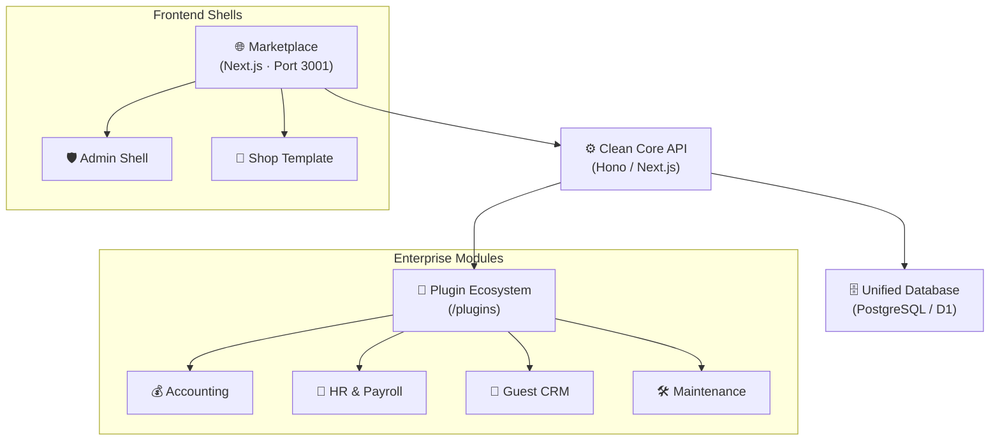

# SinaiCamps Marketplace & Enterprise ERP

> The ultimate modular platform for hospitality management. A unified monorepo featuring a Next.js Marketplace, a plugin-driven Admin Shell, and a comprehensive Enterprise ERP ecosystem.

---

## 🏗️ Architecture: The "Clean Core"

SinaiCamps is built on a **Clean Core** architecture. The main platform handles only identity, property isolation, and plugin lifecycle. All business logic—from bookings to payroll—is encapsulated in modular plugins.



---

## 📂 Repository Structure

```text
sinaicamps-marketplace/
├── src/                      # 🏛️ Core Platform (Marketplace & Admin)
│   ├── app/api/plugins/      # Plugin Registry & Lifecycle routes
│   ├── app/[locale]/         # Marketplace & Admin Pages
│   └── lib/                  # PluginDiscoveryService, DB, Auth
│
├── plugins/                  # 🔌 Enterprise Plugins (Self-contained packages)
│   ├── accounting/           # Finance & Invoicing
│   ├── loyalty/              # Guest Beats program
│   ├── hr-core/              # Employee & Payroll
│   └── ... (15+ modules)
│
├── packages/
│   └── plugin-sdk/           # 🧰 The SDK used by all plugins
│
└── templates/
    └── shop-frontend/        # 🎨 Premium React/Vite shop template
```

---

## 🚀 Quick Start

### 1. Prerequisites

- **Node.js**: ≥ 20
- **Database**: PostgreSQL (or D1 for Cloudflare deployments)

### 2. Installation

```bash
git clone https://github.com/sinaicamps/marketplace.git
cd sinaicamps-marketplace
npm install
```

### 3. Synchronise Plugins

Before starting, synchronise the filesystem plugins with the database:

```bash
# Triggers the PluginDiscoveryService to scan /plugins and update registry
curl -X POST http://localhost:3001/api/admin/plugins/sync
```

### 4. Launch the System

```bash
npm run dev
```

- **Marketplace**: `http://localhost:3001`
- **Admin Dashboard**: `http://localhost:3001/admin`
- **Plugin Registry**: `http://localhost:3001/api/plugins/ui-registry`

## ✅ Code Quality & Checks

To maintain code health and high test coverage (>80%), the project uses a unified suite of checks.

```bash
# Run formatting check, linting, and tests with coverage
npm run check

# Auto-format all code
npm run format

# Run full CI suite (including Playwright E2E)
npm run check:full
```

For more details on the testing architecture, see [TESTING.md](TESTING.md).

---

## 🔌 Plugin Development

### Creating a New Plugin

We provide a standard starter template to ensure consistency:

```bash
cp -r packages/plugin-starter plugins/my-awesome-plugin
# Edit plugins/my-awesome-plugin/plugin.json
```

### Package Structure

Each plugin must follow this structure to be discovered by the core:

- `plugin.json`: Metadata, slots, and menu items.
- `package.json`: Dependencies.
- `src/index.ts`: Backend logic (hooks, API).
- `src/ui.tsx`: Frontend components (widgets, settings).

### Registering UI Components

Plugins export a `components` map in `src/ui.tsx`. These are automatically registered in the shell's `ComponentRegistry` via the `ui-registry` API.

```typescript
// plugins/my-plugin/src/ui.tsx
export const components = {
  MyWidget,
  MySettingsPage,
};
```

---

## 🛠️ Enterprise Categories (Odoo-Inspired)

The ecosystem is categorised for enterprise-grade scalability:

- **Sales & CRM**: `loyalty`, `subscriptions`, `guest-crm`
- **Finance**: `accounting`, `financial-ops`
- **Operations**: `booking`, `maintenance`, `housekeeping`, `inventory-waste`
- **Human Resources**: `hr-core`, `staff-roster`
- **Marketing**: `marketing-automation`

---

## 📜 Documentation

- [Plugin Development Guide](docs/plugins/plugin-development.md)
- [Hook Catalog](docs/plugins/hook-catalog.md)
- [Marketplace Integration](docs/integrating-acacia-camp.md)

---

## 📄 License

Internal use only. Part of the SinaiCamps Marketplace ecosystem.
