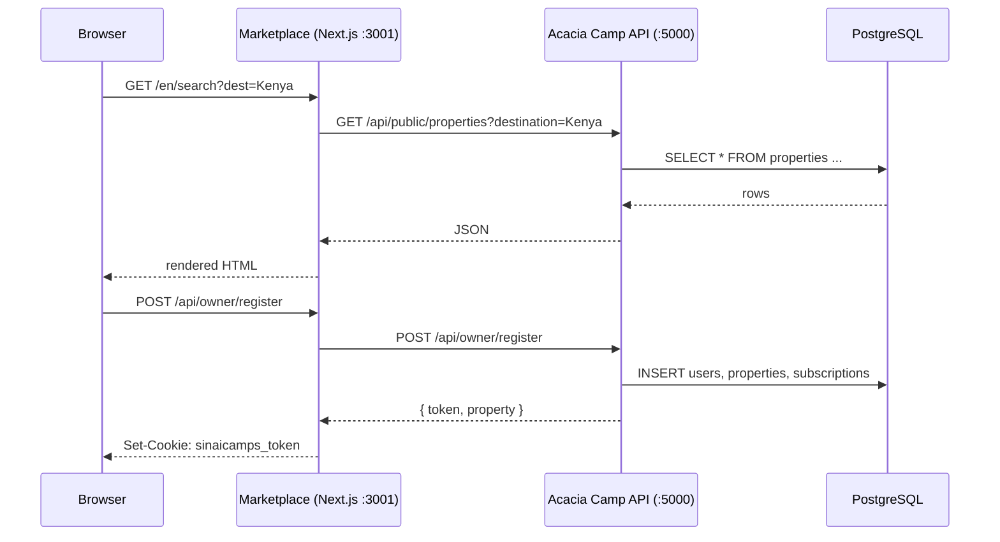

# Integrating Acacia Camp

The Marketplace is a pure frontend — it has no database of its own. All data (properties, rooms, bookings, users) lives in the **Acacia Camp** Express backend. This guide explains how to connect the two.

---

## Architecture



---

## How the proxy works

In `next.config.mjs`, all `/api/*` requests from the browser are rewritten to the Acacia Camp backend:

```js
async rewrites() {
  return [
    { source: "/api/:path*", destination: `${ACACIA_CAMP_API_URL}/api/:path*` },
    { source: "/admin",      destination: `${ADMIN_SPA_URL}/admin` },
    { source: "/admin/:path*", destination: `${ADMIN_SPA_URL}/admin/:path*` },
  ];
}
```

This means:

- The browser never needs to know the backend URL.
- CORS is not needed between the frontend and backend.
- Cookies are same-origin.

---

## Required backend API endpoints

The Marketplace depends on these Acacia Camp routes:

| Method  | Path                           | Used for                           |
| ------- | ------------------------------ | ---------------------------------- |
| `GET`   | `/api/public/properties`       | Search results                     |
| `GET`   | `/api/public/properties/:slug` | Property detail                    |
| `POST`  | `/api/public/bookings`         | Create booking                     |
| `GET`   | `/api/public/bookings/:id`     | Booking confirmation               |
| `GET`   | `/api/public/currencies`       | Currency list                      |
| `POST`  | `/api/owner/register`          | Owner self-registration            |
| `GET`   | `/api/owner/me`                | Owner property + subscription info |
| `PATCH` | `/api/properties/:id`          | Owner edits their listing          |
| `GET`   | `/api/reservations`            | Owner bookings list                |
| `GET`   | `/api/tenant/resolve?host=`    | Tenant hostname resolution         |
| `GET`   | `/api/feature-flags`           | Feature flag state                 |

---

## Setting up Acacia Camp locally

```bash
git clone https://github.com/your-org/acacia-camp.git
cd acacia-camp

# Install
npm install

# Configure
cp .env.example .env
# Set: DATABASE_URL, JWT_SECRET, PORT=5000

# Run migrations
npx tsx server/scripts/migrate-phase8.ts

# Enable required feature flags
psql $DATABASE_URL -c "
  UPDATE feature_flags SET is_enabled = true WHERE name IN (
    'multi_property', 'marketplace', 'self_service_registration'
  );
"

# Start the server
npm run dev:server
```

Verify it is running:

```bash
curl http://localhost:5000/api/feature-flags
# → { "flags": [...] }
```

---

## Connecting the Marketplace

Set `NEXT_PUBLIC_API_URL` in your Marketplace `.env.local`:

```env
NEXT_PUBLIC_API_URL=http://localhost:5000
```

That's it. The Next.js rewrite handles the rest.

---

## Shared JWT secret

The Marketplace issues `sinaicamps_token` cookies (via `/api/auth/callback`) from JWTs it receives from the backend. To validate these tokens server-side in Next.js pages (e.g., for SSR user data), set the same `JWT_SECRET` in both `.env` files:

```env
# acacia-camp/.env
JWT_SECRET=super-secret-value

# sinaicamps-marketplace/.env.local
JWT_SECRET=super-secret-value
```

---

## Production configuration

```env
# sinaicamps-marketplace/.env.production
NEXT_PUBLIC_API_URL=https://api.yourcamp.com
ADMIN_SPA_URL=https://admin-internal.yourcamp.com
NEXT_PUBLIC_BASE_DOMAIN=yourcamp.com
```

Ensure the Acacia Camp API is accessible from the server running the Marketplace (not just from the browser) — the Next.js server makes direct server-side calls to `/api/tenant/resolve` during middleware execution.

---

## Using a mock API for standalone development

If you want to run the Marketplace without a live Acacia Camp instance, create a `mock-api/` directory with a simple Express server that returns fixture JSON for the required endpoints. A basic mock is included in `scripts/mock-api.mjs`:

```bash
node scripts/mock-api.mjs   # starts on http://localhost:5000
```

Then set:

```env
NEXT_PUBLIC_API_URL=http://localhost:5000
```
