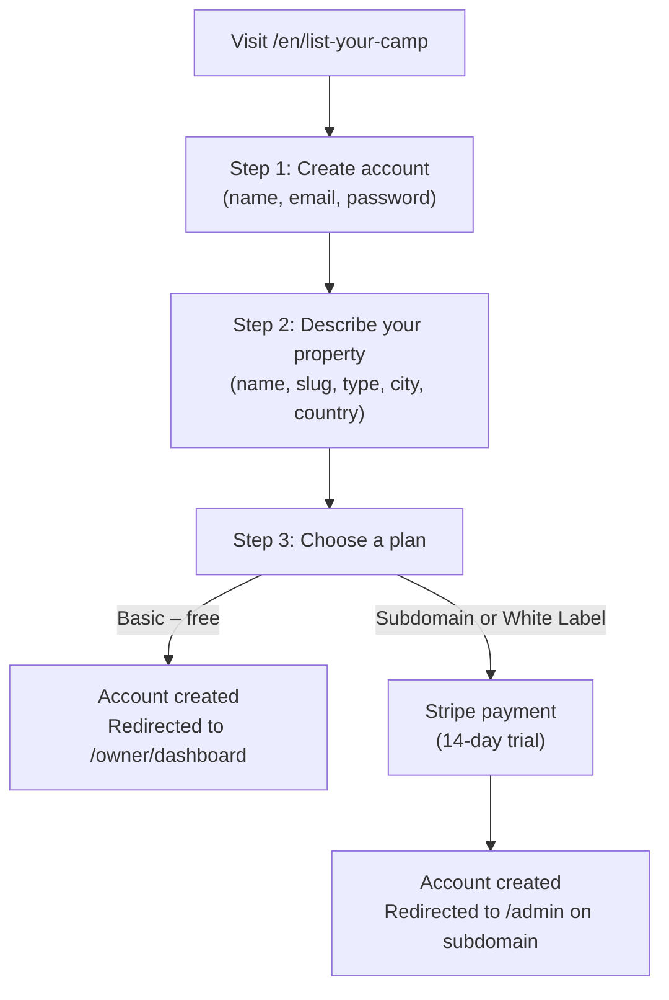

# Owner Onboarding — Property Registration & Plans

This guide explains the self-registration flow from the owner's perspective, and what happens technically at each step.

---

## The registration journey



---

## The three plans

| Plan                 | Price  | What the owner gets                                                                       | Access URL                               |
| -------------------- | ------ | ----------------------------------------------------------------------------------------- | ---------------------------------------- |
| **Basic**            | Free   | Public listing, read-only bookings, edit property details                                 | `yourdomain.com/en/owner/dashboard`        |
| **Operations Suite** | $49/mo | Full admin panel — rooms, POS, KDS, housekeeping, inventory, loyalty, reports             | `campname.yourdomain.com/admin`            |
| **White Label**      | $99/mo | Everything in Operations Suite + custom domain + managed SSL + custom branding            | `ownersdomain.com/admin`                   |

---

## Step-by-step walkthrough

### Step 1 — Account details

The owner provides:

- Full name
- Email address (must be unique in the system)
- Password (minimum 8 characters)

This data is stored in `sessionStorage` and not sent to the API yet.

### Step 2 — Property details

The owner provides:

- Property name (a URL-safe slug is auto-generated from this)
- Property type (camp, hotel, glamping, lodge, resort, villa)
- City and country
- Currency

The slug must be globally unique — it becomes the subdomain for the Operations Suite plan.

### Step 3 — Plan selection

The owner selects a plan. For **Basic**, no payment is required — the account is created immediately. For premium plans, a Stripe payment method is required before submission.

On submit, the frontend calls `POST /api/owner/register` with all three steps' data combined. The backend atomically creates:

1. A `users` record
2. A `profiles` record (role: `property_owner`)
3. A `properties` record (with `plan`, `subdomain`, and `custom_domain` fields populated)
4. A `property_staff` entry linking the owner to the property
5. A `subscriptions` record

A JWT is returned and stored as an `httpOnly` cookie via `POST /api/auth/callback`.

### Step 4 — Success

The owner is shown a confirmation page with next-step instructions and a "Go to my dashboard" button.

---

## Basic owner dashboard

Basic plan owners land at `/en/owner/dashboard` and can:

- View summary stats (upcoming bookings, revenue, occupancy)
- Edit their listing (name, description, city, photos)
- Browse incoming bookings (read-only)
- Upgrade their plan at any time

They **cannot** access `/admin` — the middleware redirects any attempt to `/en/owner/dashboard`.

---

## Premium owner access (subdomain / custom domain)

When a premium owner visits `campname.yourdomain.com`:

1. The Next.js middleware calls `GET /api/tenant/resolve?host=campname.yourdomain.com`.
2. The API returns the `propertyId` and `plan`.
3. The middleware sets `x-tenant-property-id` header in the request.
4. The `/admin` route is proxied to the Acacia Camp Vite SPA.
5. The SPA reads `window.__TENANT_PROPERTY_ID__` (set from the meta tag in `index.html`) and attaches `X-Property-Id` to every API call.
6. The Express `propertyContext` middleware validates the header and the user's membership, scoping all data to the correct property.

---

## Custom domain setup

When an owner chooses the White Label plan:

1. They enter their domain (e.g. `bookings.mycamp.com`) during registration.
2. They are shown DNS instructions: point a `CNAME` record from their domain to `yourdomain.com`.
3. A platform admin runs `PATCH /api/owner/domain-verify` once the DNS is confirmed.
4. Caddy's on-demand TLS automatically provisions a Let's Encrypt certificate for the domain.

---

## Enabling registrations

The registration flow is gated behind a feature flag. Enable it after testing:

```sql
UPDATE feature_flags SET is_enabled = true WHERE name = 'self_service_registration';
```

---

## Security considerations

- Passwords are hashed with `bcryptjs` (12 rounds).
- JWTs expire after 7 days and are stored in `httpOnly` cookies (not accessible to JavaScript).
- The `propertyContext` middleware independently verifies every API request — spoofing a property ID in a header returns HTTP 403 if the user is not a staff member.
- Basic plan owners receive HTTP 402 on any premium API route regardless of how they make the request.
